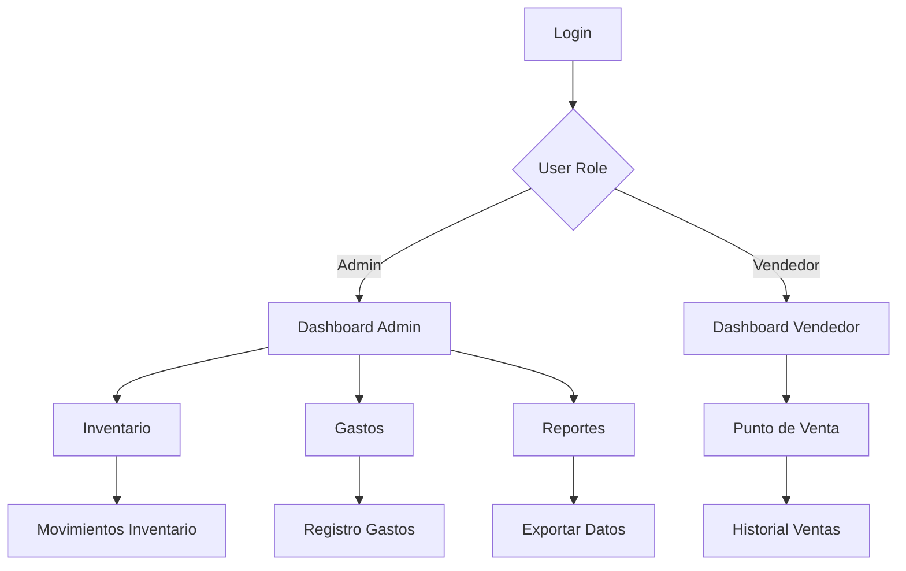

## 1. Product Overview

Sistema web integral de gestión para el local de comida rápida "Las Perras", especializado en perros calientes. La plataforma automatiza el control de inventario, ventas, gastos y genera reportes financieros con cálculo de ganancias y distribución entre socios.

Dirigido a administradores y vendedores del restaurante, permite optimizar operaciones diarias, controlar stock en tiempo real y tomar decisiones basadas en datos financieros claros.

## 2. Core Features

### 2.1 User Roles

| Role     | Registration Method             | Core Permissions                                                                        |
| -------- | ------------------------------- | --------------------------------------------------------------------------------------- |
| Admin    | Manual creation by system owner | Full access: inventory management, sales, expenses, dashboard, user management, reports |
| Vendedor | Admin invitation/creation       | Limited access: sales module, view-only inventory alerts, basic dashboard metrics       |

### 2.2 Feature Module

El sistema de gestión "Las Perras" consta de las siguientes páginas principales:

1. **Dashboard**: Vista general con métricas KPI, gráficos de ventas/gastos, distribución de utilidades, filtros por fecha
2. **Punto de Venta**: Interfaz POS para registrar ventas de perros calientes, cálculo automático de totales, descontar inventario, imprimir tickets
3. **Inventario**: Gestión completa de productos, registro de entradas/salidas, alertas de stock bajo, histórico de movimientos
4. **Gastos**: Registro y control de gastos por categorías, subida de comprobantes, reportes mensuales
5. **Reportes**: Exportación de datos a Excel/PDF, análisis detallados de ventas y gastos
6. **Login**: Autenticación de usuarios según rol asignado

### 2.3 Page Details

| Page Name      | Module Name        | Feature description                                                                                                                                  |
| -------------- | ------------------ | ---------------------------------------------------------------------------------------------------------------------------------------------------- |
| Login          | Authentication     | Ingresar email y contraseña, validación de credenciales, redirección según rol de usuario                                                            |
| Dashboard      | Métricas KPI       | Mostrar ventas totales, gastos totales, ganancia neta, distribución socios (70%/30%), filtros por día/mes/año/rango personalizado                    |
| Dashboard      | Gráficos           | Visualizar gráfico de ventas por tipo de perro, gráfico de gastos por categoría, tendencias mensuales/anuales con Chart.js                           |
| Punto de Venta | Selector Productos | Mostrar botones de tipos de perros (Básico $6k, Mejorado $7k, Especial $8k, Carnívoro $12k, Tricarne $14k, Supremo $15k), desglose de ingredientes   |
| Punto de Venta | Cálculo Venta      | Calcular total automáticamente, mostrar desglose de precios, confirmar venta, registrar fecha/hora, descontar inventario                             |
| Punto de Venta | Ticket             | Generar ticket de venta con detalles, opción de imprimir, guardar en historial de ventas                                                             |
| Inventario     | Gestión Items      | CRUD completo para cada item (pan, salchicha, tocineta, salsas, papas, queso, bebidas, carnes, huevos), control de unidades (unidades/gramos/litros) |
| Inventario     | Movimientos        | Registrar entradas/salidas de inventario, seleccionar tipo de movimiento, cantidad, fecha, motivo                                                    |
| Inventario     | Alertas            | Configurar umbral mínimo por item, mostrar alertas visuales cuando stock esté bajo, notificaciones en dashboard                                      |
| Inventario     | Historial          | Ver historial completo de movimientos por item, filtros por fecha, tipo de movimiento, exportar a Excel                                              |
| Gastos         | Registro Gasto     | Ingresar fecha, descripción, categoría (Insumos/Servicios/Transporte/Alimentación/Personal/Otros), valor, subir factura/comprobante opcional         |
| Gastos         | CRUD Gastos        | Listar todos los gastos, editar registros existentes, eliminar gastos, búsqueda por descripción/categoría                                            |
| Gastos         | Reportes           | Filtrar gastos por categoría/fecha, generar reporte mensual con totales por categoría, exportar a PDF/Excel                                          |
| Reportes       | Exportación        | Exportar datos de ventas, gastos e inventario a Excel/PDF, generar reportes personalizados por período                                               |

## 3. Core Process

### Flujo Admin

1. Login con credenciales de administrador
2. Dashboard: Visualizar métricas generales del negocio y distribución de utilidades
3. Inventario: Gestionar productos, registrar entradas de mercancía, ver alertas de stock
4. Gastos: Registrar gastos del negocio, categorizarlos, subir comprobantes
5. Reportes: Analizar datos financieros, exportar información para contabilidad
6. Cierre diario: Revisar inventario final, confirmar cálculo de ganancias

### Flujo Vendedor

1. Login con credenciales de vendedor
2. Punto de Venta: Registrar ventas de perros calientes durante el día
3. Dashboard: Ver solo métricas básicas de ventas del día
4. Inventario: Solo ver alertas de stock bajo, no puede modificar

## 4. User Interface Design

### 4.1 Design Style

* **Colores primarios**: Rojo (#DC2626) y Amarillo (#EAB308) - colores típicos de comida rápida

* **Colores secundarios**: Blanco (#FFFFFF), Gris oscuro (#374151) para textos

* **Botones**: Estilo redondeado con sombras sutiles, hover effects con cambio de color

* **Tipografía**: Inter para headers, Roboto para body text

* **Tamaños de fuente**: Headers 24-32px, body 14-16px, small text 12px

* **Layout**: Diseño card-based con navegación lateral para desktop, bottom navigation para mobile

* **Iconos**: Estilo outline de Heroicons, colores consistentes con paleta

### 4.2 Page Design Overview

| Page Name      | Module Name    | UI Elements                                                                                          |
| -------------- | -------------- | ---------------------------------------------------------------------------------------------------- |
| Dashboard      | KPI Cards      | Cards con bordes redondeados, iconos grandes, números en negrita, colores verde/rojo según tendencia |
| Dashboard      | Gráficos       | Chart.js con colores de marca, tooltips personalizados, leyendas claras                              |
| Punto de Venta | Grid Productos | Grid responsivo de 2-3 columnas, botones grandes con imágenes de perros, precios destacados          |
| Inventario     | Tabla Items    | Tabla con zebra striping, badges de stock (verde/ambar/rojo), botones de acción compactos            |
| Gastos         | Formulario     | Formulario vertical con campos espaciados, selector de categoría con colores, preview de comprobante |

### 4.3 Responsiveness

* Diseño desktop-first con breakpoints en 768px y 1024px

* Sidebar colapsable en tablets, bottom navigation en móviles

* Tablas horizontales scrollables en móviles

* Botones de tamaño mínimo 44px para touch optimization

* Cards que se apilan verticalmente en mó

