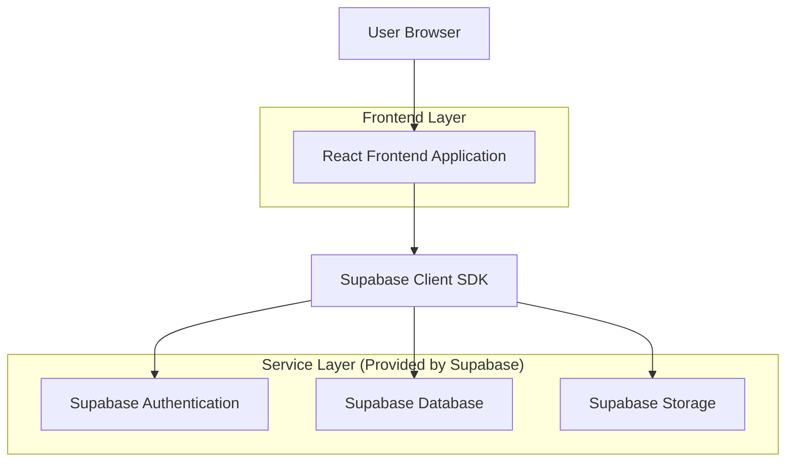
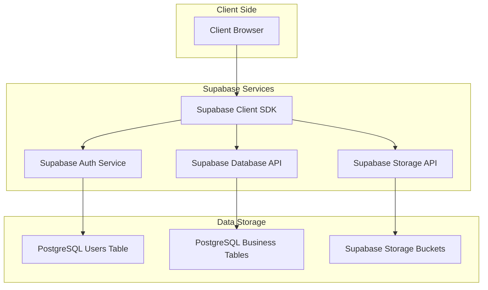
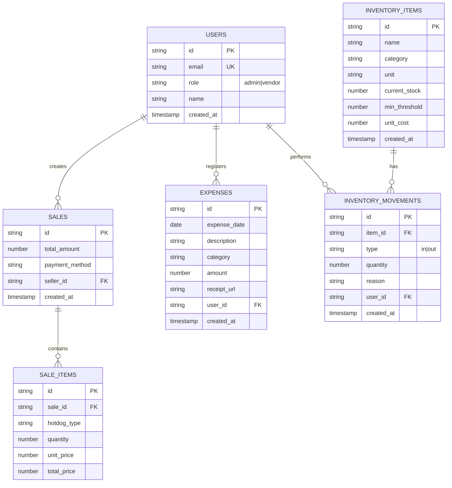

## 1. Architecture design



## 2. Technology Description

- Frontend: React@18 + tailwindcss@3 + vite
- Initialization Tool: vite-init
- Backend: Supabase (Authentication + PostgreSQL + Storage)
- Charts: chart.js@4
- UI Components: headlessui@1 + heroicons@2
- State Management: React Context + useReducer
- Forms: react-hook-form + zod

## 3. Route definitions

| Route | Purpose |
|-------|---------|
| /login | Authentication page for admin and vendor users |
| /dashboard | Main dashboard with KPIs and profit distribution |
| /pos | Point of sale interface for hot dog sales |
| /inventory | Inventory management with CRUD operations |
| /expenses | Expense tracking and categorization |
| /reports | Data export and detailed reports |
| /settings | User management and system configuration (admin only) |

## 4. API definitions

### 4.1 Authentication API

```
POST /auth/v1/token
```

Request:
| Param Name | Param Type | isRequired | Description |
|------------|-------------|-------------|-------------|
| email | string | true | User email address |
| password | string | true | User password |

Response:
| Param Name | Param Type | Description |
|------------|-------------|-------------|
| access_token | string | JWT token for API access |
| refresh_token | string | Token for refreshing session |
| user | object | User data including role |

### 4.2 Inventory API

```
GET /rest/v1/inventory_items
POST /rest/v1/inventory_items
PATCH /rest/v1/inventory_items
DELETE /rest/v1/inventory_items
```

Inventory Item Type:
```typescript
interface InventoryItem {
  id: string;
  name: string;
  category: 'Panadería' | 'Proteínas' | 'Aderezos' | 'Complementos' | 'Bebidas' | 'Carnes';
  unit: 'unidades' | 'gramos' | 'litros';
  current_stock: number;
  min_threshold: number;
  unit_cost: number;
  created_at: string;
  updated_at: string;
}
```

### 4.3 Sales API

```
POST /rest/v1/sales
GET /rest/v1/sales
```

Sale Type:
```typescript
interface Sale {
  id: string;
  items: SaleItem[];
  total_amount: number;
  payment_method: 'cash' | 'card';
  seller_id: string;
  created_at: string;
}

interface SaleItem {
  hotdog_type: 'Básico' | 'Mejorado' | 'Especial' | 'Carnívoro' | 'Tricarne' | 'Supremo';
  quantity: number;
  unit_price: number;
  total_price: number;
}
```

### 4.4 Expenses API

```
POST /rest/v1/expenses
GET /rest/v1/expenses
```

Expense Type:
```typescript
interface Expense {
  id: string;
  date: string;
  description: string;
  category: 'Insumos' | 'Servicios' | 'Transporte' | 'Alimentación' | 'Personal' | 'Otros';
  amount: number;
  receipt_url?: string;
  created_by: string;
  created_at: string;
}
```

## 5. Server architecture diagram



## 6. Data model

### 6.1 Data model definition



### 6.2 Data Definition Language

Users Table:
```sql
CREATE TABLE users (
  id UUID PRIMARY KEY DEFAULT gen_random_uuid(),
  email VARCHAR(255) UNIQUE NOT NULL,
  role VARCHAR(20) CHECK (role IN ('admin', 'vendor')) DEFAULT 'vendor',
  name VARCHAR(100) NOT NULL,
  created_at TIMESTAMP WITH TIME ZONE DEFAULT NOW()
);

-- Enable Row Level Security
ALTER TABLE users ENABLE ROW LEVEL SECURITY;

-- Policies
CREATE POLICY "Users can view own profile" ON users
  FOR SELECT USING (auth.uid() = id);

CREATE POLICY "Admin can view all users" ON users
  FOR SELECT USING (EXISTS (
    SELECT 1 FROM users WHERE id = auth.uid() AND role = 'admin'
  ));
```

Inventory Items Table:
```sql
CREATE TABLE inventory_items (
  id UUID PRIMARY KEY DEFAULT gen_random_uuid(),
  name VARCHAR(100) NOT NULL,
  category VARCHAR(50) CHECK (category IN ('Panadería', 'Proteínas', 'Aderezos', 'Complementos', 'Bebidas', 'Carnes')),
  unit VARCHAR(20) CHECK (unit IN ('unidades', 'gramos', 'litros')),
  current_stock DECIMAL(10,2) NOT NULL DEFAULT 0,
  min_threshold DECIMAL(10,2) NOT NULL DEFAULT 10,
  unit_cost DECIMAL(10,2) NOT NULL DEFAULT 0,
  created_at TIMESTAMP WITH TIME ZONE DEFAULT NOW(),
  updated_at TIMESTAMP WITH TIME ZONE DEFAULT NOW()
);

-- Indexes
CREATE INDEX idx_inventory_category ON inventory_items(category);
CREATE INDEX idx_inventory_low_stock ON inventory_items(current_stock) WHERE current_stock <= min_threshold;

-- RLS Policies
ALTER TABLE inventory_items ENABLE ROW LEVEL SECURITY;
CREATE POLICY "All authenticated users can read inventory" ON inventory_items
  FOR SELECT USING (auth.role() = 'authenticated');
CREATE POLICY "Only admin can modify inventory" ON inventory_items
  FOR ALL USING (EXISTS (
    SELECT 1 FROM users WHERE id = auth.uid() AND role = 'admin'
  ));
```

Sales Tables:
```sql
CREATE TABLE sales (
  id UUID PRIMARY KEY DEFAULT gen_random_uuid(),
  total_amount DECIMAL(10,2) NOT NULL,
  payment_method VARCHAR(20) CHECK (payment_method IN ('cash', 'card')),
  seller_id UUID REFERENCES users(id),
  created_at TIMESTAMP WITH TIME ZONE DEFAULT NOW()
);

CREATE TABLE sale_items (
  id UUID PRIMARY KEY DEFAULT gen_random_uuid(),
  sale_id UUID REFERENCES sales(id) ON DELETE CASCADE,
  hotdog_type VARCHAR(20) CHECK (hotdog_type IN ('Básico', 'Mejorado', 'Especial', 'Carnívoro', 'Tricarne', 'Supremo')),
  quantity INTEGER NOT NULL CHECK (quantity > 0),
  unit_price DECIMAL(10,2) NOT NULL,
  total_price DECIMAL(10,2) NOT NULL
);

-- Indexes
CREATE INDEX idx_sales_date ON sales(created_at DESC);
CREATE INDEX idx_sales_seller ON sales(seller_id);
CREATE INDEX idx_sale_items_sale ON sale_items(sale_id);

-- RLS Policies
ALTER TABLE sales ENABLE ROW LEVEL SECURITY;
ALTER TABLE sale_items ENABLE ROW LEVEL SECURITY;
CREATE POLICY "Authenticated users can read sales" ON sales
  FOR SELECT USING (auth.role() = 'authenticated');
CREATE POLICY "Vendors can create sales" ON sales
  FOR INSERT WITH CHECK (seller_id = auth.uid());
```

Expenses Table:
```sql
CREATE TABLE expenses (
  id UUID PRIMARY KEY DEFAULT gen_random_uuid(),
  expense_date DATE NOT NULL,
  description TEXT NOT NULL,
  category VARCHAR(50) CHECK (category IN ('Insumos', 'Servicios', 'Transporte', 'Alimentación', 'Personal', 'Otros')),
  amount DECIMAL(10,2) NOT NULL CHECK (amount > 0),
  receipt_url TEXT,
  user_id UUID REFERENCES users(id),
  created_at TIMESTAMP WITH TIME ZONE DEFAULT NOW()
);

-- Indexes
CREATE INDEX idx_expenses_date ON expenses(expense_date DESC);
CREATE INDEX idx_expenses_category ON expenses(category);
CREATE INDEX idx_expenses_user ON expenses(user_id);

-- RLS Policies
ALTER TABLE expenses ENABLE ROW LEVEL SECURITY;
CREATE POLICY "Authenticated users can read expenses" ON expenses
  FOR SELECT USING (auth.role() = 'authenticated');
CREATE POLICY "Users can create own expenses" ON expenses
  FOR INSERT WITH CHECK (user_id = auth.uid());
CREATE POLICY "Admin can modify all expenses" ON expenses
  FOR ALL USING (EXISTS (
    SELECT 1 FROM users WHERE id = auth.uid() AND role = 'admin'
  ));
```

-- Initial inventory data
INSERT INTO inventory_items (name, category, unit, current_stock, min_threshold, unit_cost) VALUES
('Pan de perro', 'Panadería', 'unidades', 100, 20, 500),
('Salchicha', 'Proteínas', 'unidades', 150, 30, 1200),
('Tocineta', 'Proteínas', 'gramos', 5000, 1000, 80),
('Cebolla', 'Complementos', 'gramos', 3000, 500, 40),
('Salsa BBQ', 'Aderezos', 'gramos', 2000, 300, 25),
('Salsa Mayonesa', 'Aderezos', 'gramos', 2000, 300, 20),
('Salsa Mostaza', 'Aderezos', 'gramos', 1500, 200, 15),
('Papa Fosforito', 'Complementos', 'gramos', 8000, 1500, 35),
('Queso', 'Complementos', 'gramos', 4000, 800, 60),
('CocaCola Personal', 'Bebidas', 'unidades', 50, 15, 2500),
('CocaCola 1L', 'Bebidas', 'unidades', 30, 10, 4500),
('CocaCola 1.5L', 'Bebidas', 'unidades', 25, 8, 5500),
('Carne de Cerdo', 'Carnes', 'gramos', 3000, 500, 120),
('Carne de Pollo', 'Carnes', 'gramos', 2500, 400, 100),
('Desmechada de Res', 'Carnes', 'gramos', 2000, 300, 150),
('Huevos de Codorniz', 'Complementos', 'unidades', 48, 12, 300);