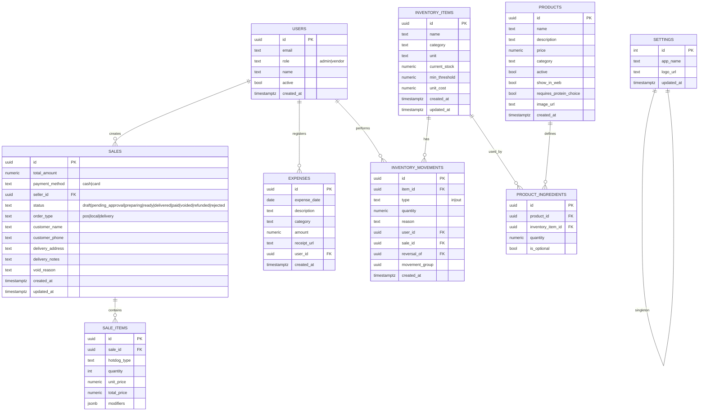

# Arquitectura Técnica — Las Perras

Última actualización: 2026-03-28

## 1. Diseño de Arquitectura

```mermaid
graph TD
  A[Navegador (Público o Staff)] --> B[SPA React + Vite]
  B --> C[@supabase/supabase-js]
  C --> D[Auth (Supabase)]
  C --> E[PostgREST (DB API)]
  C --> R[Realtime (WebSocket)]
  C --> F[Storage (Comprobantes/Logos)]

  subgraph Frontend
    B
  end

  subgraph Supabase
    D
    E
    R
    F
  end
```

## 2. Tecnologías (estado actual del repo)

- Frontend: React 18 + TypeScript + Vite 6
- UI: Tailwind CSS 3 + Headless UI + Heroicons + Lucide
- Estado global: Zustand (stores: auth, settings, notifications/pedidos)
- Formularios y validación: React Hook Form + Zod
- Gráficas: Chart.js + Recharts
- Reportes: jsPDF + jsPDF-Autotable
- Backend: Supabase (Auth + PostgreSQL + Storage + Realtime)

## 3. Rutas (SPA)

| Ruta | Acceso | Propósito |
|---|---|---|
| / | Público | Landing |
| /menu | Público | Menú público y creación de pedido web |
| /login | Staff | Autenticación |
| /dashboard | Staff | KPIs y gráficos |
| /pos | Vendor/Admin | Punto de venta |
| /orders | Vendor/Admin | Caja / Pedidos (flujo de estados y cobro) |
| /web-orders | Vendor/Admin | Bandeja de pedidos web entrantes (aprobar/rechazar) |
| /inventory | Staff | Inventario y alertas |
| /products | Admin | Productos/recetas y publicación web |
| /expenses | Staff | Gastos y comprobantes |
| /reports | Staff | Reportes y exportación |
| /settings | Admin | Configuración y gestión de usuarios |

## 4. Integración con Supabase (APIs usadas)

La aplicación se integra mayoritariamente con Supabase mediante `@supabase/supabase-js` usando:

- PostgREST: `.from('tabla').select/update/insert/delete`
- RPC: `.rpc('nombre_funcion', params)`
- Realtime: `.channel(...).on('postgres_changes', ...).subscribe()`
- Auth: `supabase.auth.signInWithPassword`, `onAuthStateChange`, etc.
- Storage: subida/lectura de comprobantes y logos según políticas.

### 4.1 Auth (staff)

- Login contra Supabase Auth.
- Perfil/rol real en tabla `users` (role: `admin` o `vendor`).
- Rutas protegidas y autorización por rol en el frontend.

### 4.2 Pedido público seguro (RPC)

Para evitar dar permisos directos a usuarios anónimos, la creación de pedido web se realiza con una función:

- `public.crear_pedido_publico(...)` (`SECURITY DEFINER`)
  - Valida tipo de pedido (`local`/`delivery`)
  - Recalcula total usando precios reales desde `products`
  - Inserta `sales` con `status = pending_approval` y los datos del cliente
  - Inserta `sale_items` con nombre/precio reales

### 4.3 Realtime (Pedidos en tiempo real)

Se usa Realtime para escuchar cambios en `sales`:

- Canal: `public:sales` con `postgres_changes` (`event: '*'`).
- Al recibir INSERT/UPDATE en `sales`, se hace un fetch puntual para obtener la venta completa con `sale_items`, y se actualiza el store global.
- Base de datos: la tabla `sales` está habilitada en la publicación `supabase_realtime`.

## 5. Reglas de negocio en DB

### 5.1 Estados y transiciones

La base de datos restringe cambios inválidos de estado con un trigger:

- `trg_check_sales_status_transition` (antes de UPDATE de `sales.status`)
- Función `check_sales_status_transition()` que permite únicamente transiciones definidas (incluye `pending_approval` → `preparing|rejected`).

## 6. Modelo de Datos (alto nivel)

```mermaid
erDiagram
  USERS ||--o{ SALES : creates
  USERS ||--o{ EXPENSES : registers
  USERS ||--o{ INVENTORY_MOVEMENTS : performs
  INVENTORY_ITEMS ||--o{ INVENTORY_MOVEMENTS : has
  SALES ||--o{ SALE_ITEMS : contains

  PRODUCTS ||--o{ PRODUCT_INGREDIENTS : defines
  INVENTORY_ITEMS ||--o{ PRODUCT_INGREDIENTS : used_by

  SETTINGS ||--|| SETTINGS : singleton

  USERS {
    uuid id PK
    text email
    text role "admin|vendor"
    text name
    bool active
    timestamptz created_at
  }

  SALES {
    uuid id PK
    numeric total_amount
    text payment_method "cash|card"
    uuid seller_id FK
    text status "draft|pending_approval|preparing|ready|delivered|paid|voided|refunded|rejected"
    text order_type "pos|local|delivery"
    text customer_name
    text customer_phone
    text delivery_address
    text delivery_notes
    text void_reason
    timestamptz created_at
    timestamptz updated_at
  }

  SALE_ITEMS {
    uuid id PK
    uuid sale_id FK
    text hotdog_type
    int quantity
    numeric unit_price
    numeric total_price
    jsonb modifiers
  }

  INVENTORY_ITEMS {
    uuid id PK
    text name
    text category
    text unit
    numeric current_stock
    numeric min_threshold
    numeric unit_cost
    timestamptz created_at
    timestamptz updated_at
  }

  INVENTORY_MOVEMENTS {
    uuid id PK
    uuid item_id FK
    text type "in|out"
    numeric quantity
    text reason
    uuid user_id FK
    uuid sale_id FK
    uuid reversal_of FK
    uuid movement_group
    timestamptz created_at
  }

  PRODUCTS {
    uuid id PK
    text name
    text description
    numeric price
    text category
    bool active
    bool show_in_web
    bool requires_protein_choice
    text image_url
    timestamptz created_at
  }

  PRODUCT_INGREDIENTS {
    uuid id PK
    uuid product_id FK
    uuid inventory_item_id FK
    numeric quantity
    bool is_optional
  }

  EXPENSES {
    uuid id PK
    date expense_date
    text description
    text category
    numeric amount
    text receipt_url
    uuid user_id FK
    timestamptz created_at
  }

  SETTINGS {
    int id PK
    text app_name
    text logo_url
    timestamptz updated_at
  }
```

## 7. Consideraciones Operativas

### 7.1 Zona horaria

El negocio opera en Colombia (-05:00). Para consultas por rango del “día”, se recomienda construir ventanas de tiempo con offset -05:00 para evitar cortes por UTC en horas de la tarde/noche.

### 7.2 Rendimiento y costos

Realtime reduce polling, pero introduce suscripciones WebSocket. Se recomienda:

- Mantener el canal con filtros cuando el volumen crezca (por fecha/estado).
- Evitar “N+1 queries” excesivas al recibir eventos; preferir agrupar fetches o cache de `sale_items` si aumenta la carga.

### 7.3 Seguridad

- No usar `service_role_key` en frontend.
- Aislar escritura anónima a través de RPC segura.
- Mantener RLS habilitado en tablas sensibles.
